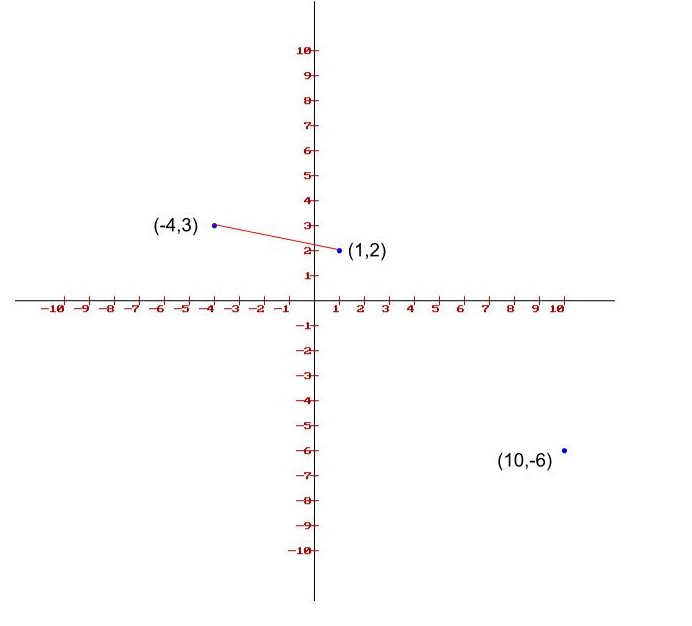

# Closest Pair of Points

**Problem Definition:** Given a set of n points, find the closest pair of points. Points with **least distance**.

Distance between pair of points \(x,y\) and \(z,w\) are computed using euclidean distance which is given as follows: $$distance = \sqrt{(x-z)^{2} +(y-w)^{2} }$$ 



**Brute-force approach** could be finding the distance between every pair of points and identifying the pair with shortest distance.

```text

```


