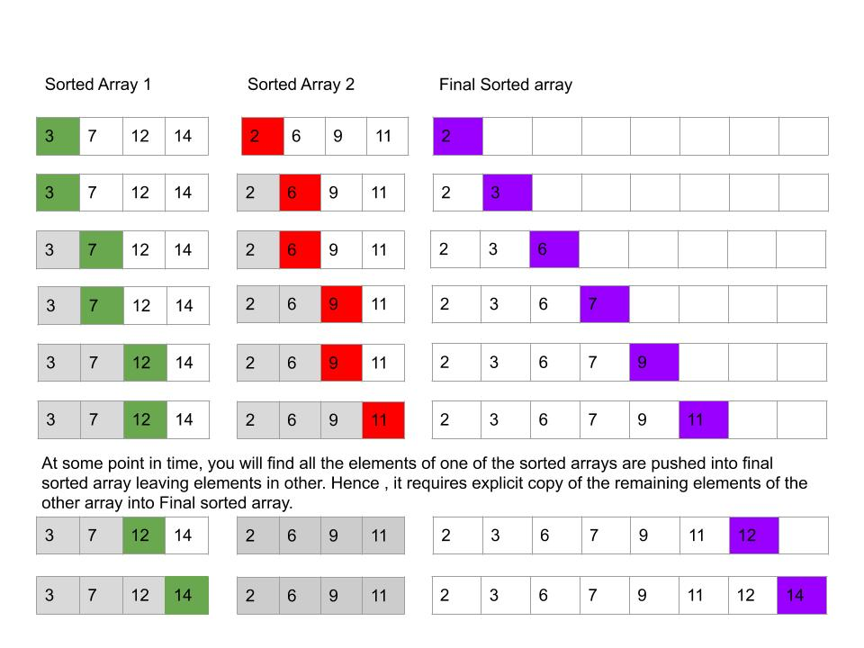
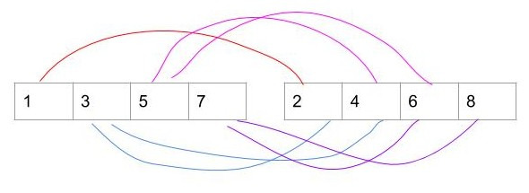

# Merge Sort

Merge sort is a simplest sorting technique which adopts D&C strategy. 

1. If the size of array is 2 , then one comparison is required to sort them. 
2. If the size is less than 2, then return the array as such. 
3. When the size is greater than 2, divide the array into two halves $$A[0,1.......\lfloor\frac{n}{2}\rfloor -1]$$  and $$A[\lfloor\frac{n}{2}\rfloor,..... n-1]$$ \(partition in the middle\). 
   1. Sort them recursively
   2. Merge the smaller sorted arrays into a single sorted one



```text
void MergeSort(int A[] , int low, int high){
        if(high-low == 1){
                if(A[low]>A[high]){
                        int temp=A[low];
                        A[low]=A[high];
                        A[high]=temp;
                }
        }
        else if(high<=low){
                return;
        }
        else{
                int mid= (low+high)/2;
                MergeSort(A,low,mid);   
                MergeSort(A,mid+1,high);
                merge(A,low,mid,high);
        }
}

```



**Merge Procedure:** Combine two sorted arrays into a single array. It is done as follows:

1. Two pointers are initialized to point to first elements of the array being merged.
2. The elements pointed are compared and the smaller is added to the final sorted array. Pointer of the smaller element is incremented to point to its immediate sucessor in the array it was copied from
3. Repeat the procedure \(Step 2\)  until one of the array is completely exhausted
4. Then, copy  the remaining elements of the other array to the end of the final sorted array.

| Sorted Array 1 |  |  |  |  |
| :--- | :--- | :--- | :--- | :--- |
| Sorted Array 2 |  |  |  |  |





```text
void merge (int A[],int low,int mid,int high){
        /* Indexes from low to mid correspond to sorted array 1
        and Indes from mid+1 to high correspond to sorted array 2*/
        int i = low;
        int j = mid+1;
        int k = low;
        int B[high+1];/*auxilary array to support sorting*/

        while(i<=mid && j<=high){
                if(A[i]<=A[j])
                {
                        B[k]=A[i];
                        i++;
                }
                else
                {
                        B[k]=A[j];
                        j++;
                }
                k++;
        }

        /* One of the array would have been exhausted*/
        if(i<=mid){
                for(int l=i; l<=mid; l++){
                        B[k]=A[l]; k++;
                }
        }
        else{
                for(int l=j;l<=high;l++){
                        B[k]=A[l]; k++;
                }
        }

        /*Copy elements to original array*/
        for(i=low; i<=high;i++){
                A[i] =B[i];
        }
}

```



**Time Complexity of Merge Sort:**

Let n represents the Input Size \(Number of elements in the array\) and key comparisons indicate the basic operation. Then, the recurrence relation is given as $$T(n) = 2 T(n/2) + C_{merge}(n) for n>2 ; T(1) = 0; T(2) = 1 $$ 

$$C_{merge}(n) $$ denote number of comparisons performed during the merge stage. In the worst case, neither of two arrays become empty before the other one just contains on element. Example is shown below



Hence, in the worst case the number of key comparisons $$C_{merge}(n) = n-1$$. Therefore,  $$T(n)= 2T(n/2) + (n-1)  $$ for n&gt;2. According to Master's theorem $$T(n) = \theta(nlogn)$$ 

