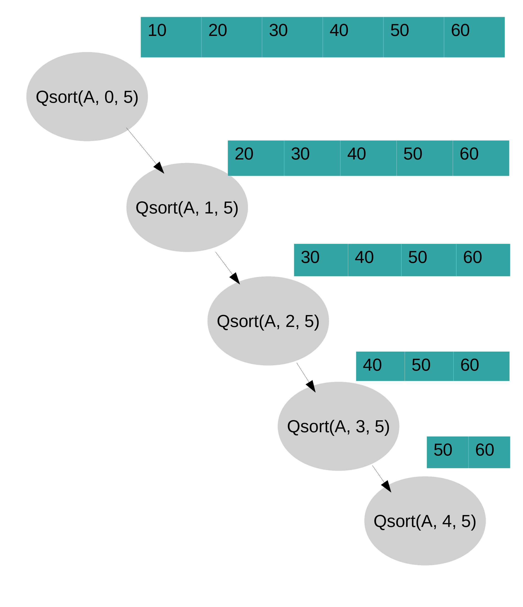

# Quick sort

It divides the array based on value. It rearranges the element of a given array before partitioning such that all elements before the partitioning position are smaller and all elements after the partitioning position are larger

The algorithm proceeds as follows

```text
1. If there is one element in array (or) 
If the array doesnot contain any element in the array return

2. Pick an element to serve as pivot point 
   Place element in correct position
   reorder elements so that
   elements before pivot point are smaller
   elements after pivot point are larger
   
3. Split the array into two halves 

4. Repeat the algorithm for both the halves
```

The tricky part of the Quick sort is how to achieve the partition.

Choose the pivot element \(Usually leftmost \(or\) rightmost element in the array will act as the pivot element\)

And then two scans are been done to bring the smaller elements to left half and larger elements to the right half 

1. Left to right scan \(i\)  - starts with second element of the sub-array and tries to find elements that are larger than the pivot
2. Right to left scan \(j\) - starts with the last element of the sub-array and tries to find elements that are smaller than pivot

After the scans are over , three cases may occur 

1. i&lt;j exchange values at i and j, resume the scan
2. i&gt;j exchange j and pivot 
3. i=j value of pivot and value at j are equal

```text
int partition(int A[], int low, int high){

	int i = low+1;
	int j = high; 
	int pivot = low;

	while(i<=j){
		while(A[pivot]>=A[i] && i<high){
			i++;
		}
		//printf("i:%d",i);
		while(A[pivot]<A[j] && j>low){
			j--;
		}
		//printf("j:%d",j);
		if(i>=j){
			int temp = A[pivot];
			A[pivot] = A[j];
			A[j] = temp;
		}
		else{
			int temp = A[i];
			A[i] = A[j];
			A[j] = temp;
		}
	}
	return j;

}


void QSort(int A[], int low, int high){
	if(low<high){
		int p = partition(A, low, high);
		//printf("%d",p);
		QSort(A, low, p-1);
		QSort(A, p+1, high);
	}
}

```

**Analysis of the time complexity**

n -  Number of elements in the array  Basic Operation is the comparison between the elements

**Time complexity varies with the input** 

Let T\(n\) be the complexity of quick sort. Number of key comparisons made before the partition  = n+1 \(point where the indices cross over\)

In the **Best Case** split happens in the middle of the corresponding sub-arrays T\(n\) = 2T\(n/2\) + n \(n&gt;1\)        T\(1\) = 0. Through master's theorem, it get resolved as $$T(n) =\theta(nlogn)$$ 

In the W**orst case,** arrays are already in sorted order, partition procedure result in a split where one sub-array is empty and the other sub-array has elements one less than the size of the sub-array being partitioned . Hence if there are n elements, then it takes n+1 comparisons and array is split into {} array and subarray with size n-1 as shown below. After the first iteration , 10 is placed in correct location and Qsort is invoked on remaining set of elements

Total number of comparisons = $$(n+1) + n + (n-1) + (n-2) + ........ 2   = \frac{n(n+1)}{2} =O({n}^2)$$ 



**Test Your Understanding:**

1. Why Quick sort is not stable?
2. Most practical implementations of Quick Sort use randomized version. The randomized version has expected time complexity of O\( $$nlogn$$ \). The worst case is possible in randomized version also, but worst case doesn’t occur for a particular pattern \(like sorted array\) and randomized Quick Sort works well in practice. **Implement Randomized Quick Sort version \[  Pick a random element, Swap with the leftmost element and perform partition \]**

